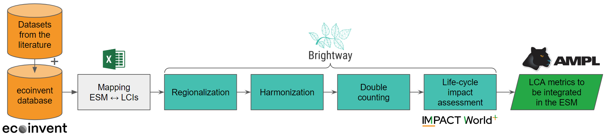

# _mescal_

[][pypi status]
[][pypi status]
[][pypi status]

[][License]
[][read the docs]
[][tests]
[][codecov]
[][doi]

[][pre-commit]
[][black]

[pypi status]: https://pypi.org/project/mescal/
[read the docs]: https://mescal.readthedocs.io/
[tests]: https://github.com/matthieu-str/mescal/actions?workflow=Tests
[codecov]: https://codecov.io/gh/matthieu-str/mescal
[pre-commit]: https://github.com/pre-commit/pre-commit
[black]: https://github.com/psf/black
[doi]: https://zenodo.org/doi/10.5281/zenodo.12727521

## What is _mescal_?

_mescal_ is a Python package for the creation and management of life-cycle inventory databases and metrics derived from life-cycle assessment, to be integrated in decision-making tools such as energy system models.

_mescal_ is a specialized package of the [Brightway Software Framework](https://brightway.dev/), mainly relying on the [bw2calc](https://github.com/brightway-lca/brightway2-calc) and [wurst](https://github.com/polca/wurst) Python packages.

_mescal_ was designed for all researchers and modellers aiming to include life-cycle assessment (LCA) in their work, but who are not necessarily LCA experts. Mescal is usually used within [Jupyter notebooks](https://jupyter.org/).




LCI datasets are taken from ecoinvent and possibly other sources if some of the ESM technologies are not covered in the ecoinvent database, e.g., [_premise_](https://linkinghub.elsevier.com/retrieve/pii/S136403212200226X) additional inventories. These LCI datasets are mapped to the ESM technologies and resources. This is followed by operations of regionalization, databases harmonization, double-counting removal, and life-cycle impact assessment. LCA indicators are then ready to be integrated to the ESM.

## How to use _mescal_?

You can follow this [example notebook](https://github.com/matthieu-str/mescal/blob/master/examples/tutorial.ipynb) to learn how to use _mescal_.

## Requirements

- **Python 3.10 or more** 
- Licence for [ecoinvent 3](https://ecoinvent.org/). The ecoinvent database is not included in this package. You may also check ecoinvent's [GDPR & EULA](https://ecoinvent.org/gdpr-eula/). 

## Installation

You can install _mescal_ via [pip] from [PyPI]:

```console
$ pip install mescal
```

## Contributing

Contributions are very welcome.
To learn more, see the [Contributor Guide][Contributor Guide].

## License

Distributed under the terms of the [MIT license][License],
_mescal_ is free and open source software.

## Issues

If you encounter any problems,
please [file an issue][Issue Tracker] along with a detailed description.


<!-- github-only -->

[command-line reference]: https://mescal.readthedocs.io/en/latest/usage.html
[License]: https://opensource.org/licenses/MIT
[Contributor Guide]: https://github.com/matthieu-str/mescal/blob/main/CONTRIBUTING.md
[Issue Tracker]: https://github.com/matthieu-str/mescal/issues


## Building the Documentation

You can build the documentation locally by installing the documentation Conda environment:

```bash
conda env create -f docs/environment.yaml
```

activating the environment

```bash
conda activate sphinx_mescal
```

and [running the build command](https://www.sphinx-doc.org/en/master/man/sphinx-build.html#sphinx-build):

```bash
sphinx-build docs _build/html --builder=html --jobs=auto --write-all; open _build/html/index.html
```