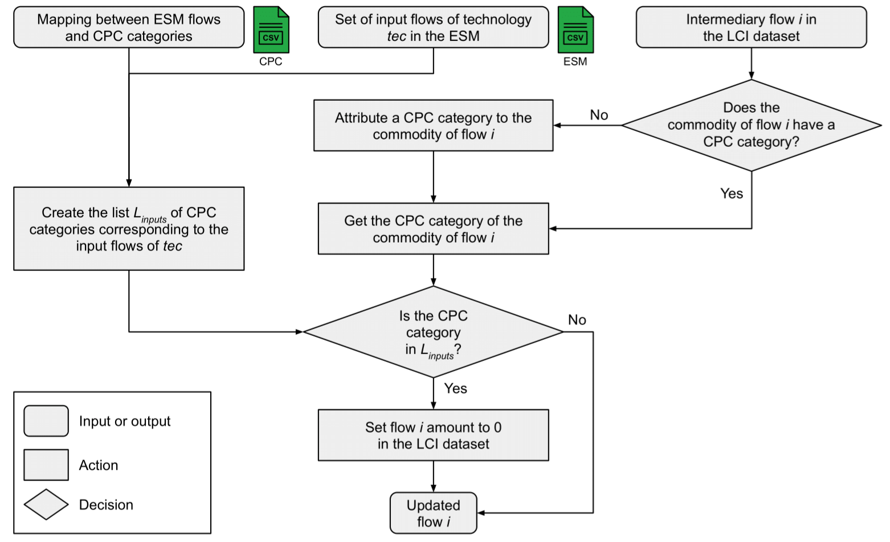

# Methods

## Mapping

Modellers should provide a mapping between the technologies and resources in the ESM and the datasets in the LCI database. Typically, a technology is mapped with an infrastructure LCI dataset (construction and end-of-life) and an operation LCI dataset, while resources are mapped with a single (operation) LCI dataset. However, this structure is not mandatory and can be adapted to the specific needs of the modeller.

## Regionalization

LCI datasets can be regionalized to match the location of the ESM. For instance, if a LCI dataset does not exist for the region of interest, a new LCI dataset can be copied and adapted from an existing one (by changing the list of providers) as a proxy. If you are using a regionalized LCI database (i.e., with region-specific elementary flows), biosphere flows will be regionalized following the same procedure.

## Harmonization

Harmonization is the process of ensuring that the LCI datasets are consistent with the ESM. It mainly consists of unit conversion and assumptions alignement. For instance, lifetime and efficiency differences between the ESM and LCI databases can be automatically corrected. 

## Double-counting removal

Double-counting occurs regarding the flows that are explicitly modelled in the ESM, e.g., energy flows (electricity, heat, fuels, etc.). Such flows should be set to zero in the LCI datasets in order to avoid an overestimation of the impacts. The double-counting removal algorithm is as follows:

## Life-cycle impact assessment

The set of LCA indicators to be included in the ESM is computed using an LCIA method, e.g., [IMPACT World+](https://www.impactworldplus.org/), [ReCiPe](https://www.rivm.nl/en/life-cycle-assessment-lca/recipe), etc. 

## Feeding the ESM results back in the LCA database

After running the ESM, the results can be fed back in the LCI database to be used in further LCA studies or for the next ESM iteration. ESM results should be formulated as annual use per technology, which will then be used to create new LCI datasets, replace the former ones if they exist. 