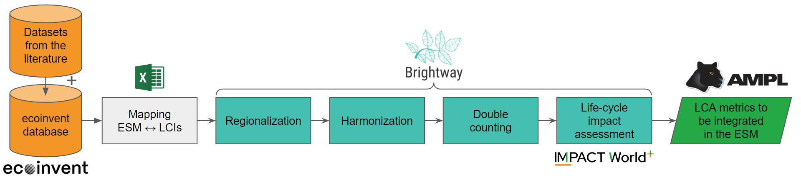

# In a nutshell

```{button-link} https://docs.brightway.dev
:color: info
:expand:
{octicon}`light-bulb;1em` mescal is a specialized package of the Brightway Software Framework
```

## Purpose

_mescal_ is a Python package for the creation and management of life-cycle inventory databases and metrics derived from life-cycle assessment, to be integrated in decision-making tools such as energy system models.

_mescal_ is a specialized package of the [Brightway Software Framework](https://brightway.dev/), mainly relying on the [_bw2calc_](https://github.com/brightway-lca/brightway2-calc) and [_wurst_](https://github.com/polca/wurst) Python packages.

_mescal_ was designed for all researchers and modellers aiming to include life-cycle assessment (LCA) in their work, but who are not necessarily LCA experts. _mescal_ is usually used within [Jupyter notebooks](https://jupyter.org/).

## Workflow



LCI datasets are taken from ecoinvent and possibly other sources if some of the ESM technologies are not covered in the ecoinvent database, e.g., [_premise_](https://linkinghub.elsevier.com/retrieve/pii/S136403212200226X) additional inventories. These LCI datasets are mapped to the ESM technologies and resources. This is followed by operations of regionalization, databases harmonization, double-counting removal, and life-cycle impact assessment. LCA indicators are then ready to be integrated to the ESM. 

## Citation

If you use _mescal_ in a scientific publication, please cite [this paper](https://link.springer.com/article/10.1007/s44498-026-00005-3):

Souttre, M., Majeau-Bettez, G., Maréchal, F., Margni, M., 2026. mescal: a tool for coupling energy system models with life-cycle assessment. J. Ind. Ecol. https://doi.org/10.1007/s44498-026-00005-3

You can also specify the version of _mescal_ you used in your publication, e.g., by including the DOI of the version you used, which can be found on [Zenodo](https://doi.org/10.5281/zenodo.12727521).

## Requirements

- **Python 3.10 or more**
- Licence for [ecoinvent 3](https://ecoinvent.org/). The ecoinvent database is not included in this package. You may also check ecoinvent's [GDPR & EULA](https://ecoinvent.org/gdpr-eula/).

## Installation

You can install _mescal_ via [pip] from [PyPI]:

```console
$ pip install mescal pypardiso
```

We recommend installing the optional package _pypardiso_ to speed up matrix calculations.

## Main contributors

- [Matthieu Souttre](https://github.com/matthieu-str)
- [Arthur Chuat](https://github.com/ArthurChuat)

```{toctree}
---
hidden:
maxdepth: 1
---
self
content/setup
content/user_inputs
examples/tutorial_quick.ipynb
examples/tutorial_advanced.ipynb
content/methods
content/glossary
content/api/index
content/codeofconduct
content/contributing
content/license
content/changelog
```
