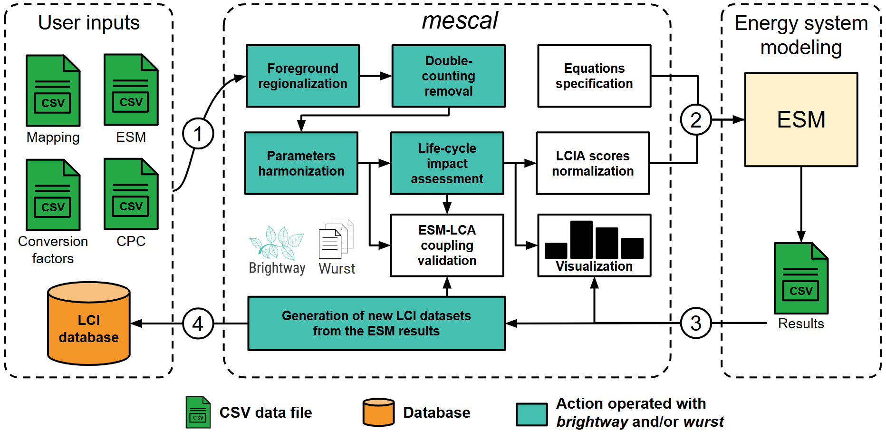

# `mescal`

```{button-link} https://docs.brightway.dev
:color: info
:expand:
{octicon}`light-bulb;1em` mescal is a specialized package of the Brightway Software Framework
```

## What is `mescal`?

`mescal` is a Python package for the creation and management of life-cycle inventory databases and metrics derived from life-cycle assessment, to be integrated in decision-making tools such as energy system models.

`mescal` is a specialized package of the [Brightway Software Framework](https://brightway.dev/), mainly relying on the [`bw2calc`](https://github.com/brightway-lca/brightway2-calc) and [`wurst`](https://github.com/polca/wurst) Python packages.

`mescal` was designed for all researchers and modellers aiming to include life-cycle assessment (LCA) in their work, but who are not necessarily LCA experts. `mescal` is usually used within [Jupyter notebooks](https://jupyter.org/).

## Workflow



LCI datasets are taken from ecoinvent and possibly other sources if some of the ESM technologies are not covered in the ecoinvent database, e.g., [`premise`](https://linkinghub.elsevier.com/retrieve/pii/S136403212200226X) additional inventories. These LCI datasets are mapped to the ESM technologies and resources. This is followed by operations of regionalization, databases harmonization, double-counting removal, and life-cycle impact assessment. LCA indicators are then ready to be integrated to the ESM. 

## Requirements

- **Python 3.10 or more**
- Licence for [ecoinvent 3](https://ecoinvent.org/). The ecoinvent database is not included in this package. You may also check ecoinvent's [GDPR & EULA](https://ecoinvent.org/gdpr-eula/).

## Installation

You can install `mescal` via [pip] from [PyPI]:

```console
$ pip install mescal pypardiso
```

We recommend installing the optional package `pypardiso` to speed up matrix calculations.

## Main contributor

- [Matthieu Souttre](https://github.com/matthieu-str)

```{toctree}
---
hidden:
maxdepth: 1
---
self
examples/tutorial.ipynb
content/methods
content/glossary
content/user_inputs
content/api/index
content/codeofconduct
content/contributing
content/license
content/changelog
```
