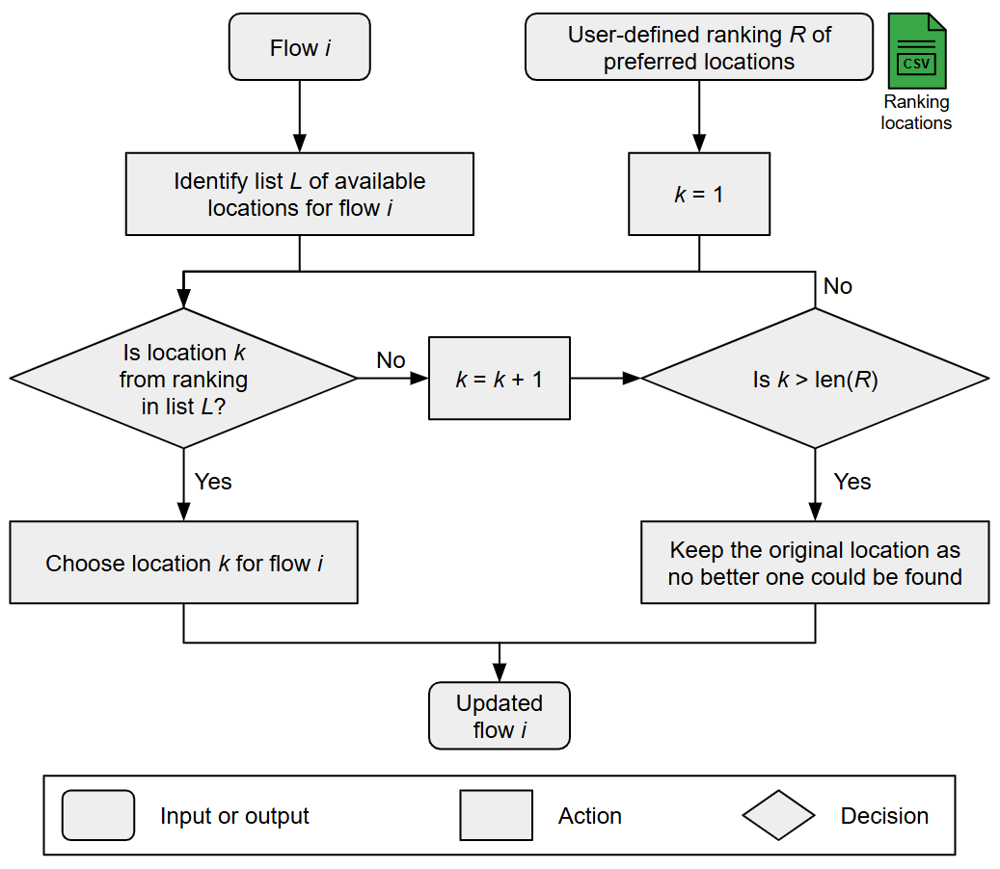

# Summary
`mescal` is a Python package that integrates Life-Cycle Assessment (LCA) indicators within Energy System Models 
(ESM). Based on the choice of one or several impact assessment methods, `mescal` generates a set of LCA indicators 
for each technology and resource of an ESM. These indicators may be employed in an ex-post analysis, or be 
integrated as parameters in ESM to add environmental constraints or define environmental objective functions. 
Furthermore, `mescal` updates the Life-Cycle Inventory (LCI) database with ESM results, thus allowing energy 
modellers and LCA practitioners to include ESM projections in their sustainability analyses.

# Statement of need
Most ESM integrate carbon emissions in their modelling to propose and assess climate change mitigation scenarios.
However, the environmental assessment of energy transition transitions should not be limited to carbon emissions.
The United Nations highlighted three major environmental challenges that humanity is currently facing: climate change, 
biodiversity loss, and air pollution [@unfccc2022]. Sustainability assessment tools like LCA integrate an even broader 
set of environmental impact categories, including as water use, land use, human toxicity, mineral resource use, etc.
It is therefore essential to enlarge the environmental assessment of energy transition scenarios while keeping 
comparable, robust and transparent methods [@hellweg2023].

LCA is often used as a post-processing tool to assess the environmental impacts of energy transition scenarios. 
However, ex-post analyses do not allow LCA indicators to be used actively in the modelling process and thus in 
the scenarios design. 
To this end, LCA indicators need to be endogenously integrated in ESM to define environmental constraints or objectives.
Several studies have endogenously integrated LCA indicators in ESM [@rauner2017; @vandepaer2020; @reinert2022].
@xu2020 went further by proposing a framework to bidirectionally couple LCA and ESM: environmental impacts are 
computed using the energy mix obtained via the ESM, thus resulting in an iterative feedback loop.
However, these studies lack generalization and are hardly reproducible when considering different ESM.

Recently, @sacchi2024 presented `pathways`, a Python package that assess energy transition scenarios with LCA. 
Based on the `brightway` framework [@mutel2017], this tool allows a fully transparent and reproducible assessment of 
energy transition scenarios generated by ESM or Integrated Assessment Models (IAM). 
However, `pathways` does not allow the direct integration of LCA indicators in ESM or IAM, neither the dynamic 
propagation of ESM results back to the LCI database.

To address these limitations, the Python package `mescal` endogenously integrates LCA indicators in ESM
and modifies the LCI database to account for ESM results. `mescal` is an open-source library based upon `wurst` and 
the `brightway` framework [@mutel2017], which aims to enhance transparency and comparability among ESM envisioning to 
enlarge their set of sustainability metrics.

# Description
`mescal` reads four mandatory CSV files:

- `Mapping.csv`: the mapping between ESM processes (i.e., technologies and resources) and LCI datasets from a LCI 
database, e.g., _ecoinvent_ [@wernet2016].

- `ESM.csv`: the input and output flows of ESM technologies. 

- `Conversion factors.csv`: the set of unit conversion factors between ESM processes and their mapped LCI datasets.

- `CPC.csv`: the mapping between ESM flows and Central Product Classification (CPC) categories [@unitednations2015].

In addition, `mescal` reads several optional CSV files, including:

- `Lifetime.csv`: the lifetime of the ESM technologies in the ESM and in the LCI database.

- `Efficiency.csv`: the list of ESM technologies and their input fuel type for which efficiency adjustment will be 
performed.

- `Ranking locations.csv`: the ranking of preferred locations available in the LCI database with respect to the ESM 
geographical context. 

`mescal` operates a set of systematic transformations on LCI datasets to make them consistent with the ESM 
(\autoref{fig:workflow}).

## Mapping between ESM processes and LCI datasets
Each technology or resource of the ESM is mapped with one or several LCI datasets (`Mapping.csv`). 
Technologies are typically mapped with two LCI datasets: 1) an operation LCI dataset, which encompasses 
the use phase of the technology's life cycle, and 2) an infrastructure LCI dataset, which encompasses the 
construction and dismantling phases of the technology's life cycle. 
The ESM resources are typically mapped with one operation LCI dataset. Regarding LCI databases, `mescal` is suited for 
any version of the _ecoinvent_ database [@wernet2016] and any LCI database generated via `premise` [@sacchi2022], which 
generates prospective versions of _ecoinvent_ using IAM projections.

## Regionalization of LCI datasets
To overcome a potential lack of location-specific LCI datasets in the LCI database, the inventory can 
be regionalized. Inventory regionalization refers to the enhancement of the geographic representativeness of the 
inventory data, which includes the type and quantity of intermediary and elementary flows 
[@patouillard2018]. `mescal` regionalizes the foreground inventory by modifying the geographical location of 
the flows of all infrastructure and operation LCI datasets according to the user-defined ranking of preferred locations 
`Ranking locations.csv` (\autoref{fig:flowchart_regionalization}). 
Foreground regionalization is always performed for intermediary flows, and also for elementary flows if the LCI database 
is spatialized, i.e., if a geographic location has been attributed to elementary flows [@patouillard2018]. 
The types and quantities of the flows remain unchanged. The LCI database can be spatialized and its background 
inventory can be regionalized using the `regioinvent` tool [@maximeagez2025].

{ width=75% }

## Double-counting removal
Double-counting refers to the overestimation of impacts due to the multiple occurrence a flow, potentially 
represented through different energy vectors, within the energy system supply chain. Volkart et al. proposed a solution 
to the double-counting issue by setting to zero all flows in the foreground inventory that were also modelled in the ESM
[@volkart2018]. This approach is implemented in `mescal` by identifying the flows to be nullified using their CPC 
categories [@unitednations2015] (\autoref{fig:flowchart_double_counting}). If infrastructure LCI datasets are used, 
the infrastructure input flows operation LCI datasets are set to zero. In the case of market-type LCI datasets, 
the flows to be nullified are contained in the background. `mescal` determines the set of LCI datasets on which the 
double-counting removal process should be applied via a recursive algorithm exploring the market-type datasets backgrounds.

## ESM and LCA database harmonization
`mescal` adjusts LCI datasets and LCIA scores to account for differences between the ESM and LCI databases:

- **Technologies lifetime**: `mescal` adjusts LCIA scores to integrate the difference in lifetime between ESM technologies and
their infrastructure LCI datasets. The specific LCIA score is multiplied by the ratio between the ESM lifetime and the LCI 
dataset lifetime to ensure that the annual impact in the ESM is computed with the LCI dataset lifetime. 
This ensures the coherence between the LCIA score and the LCI dataset lifetime.

- **Technologies efficiency**: Even if input fuel flows are set to zero in the operation LCI dataset to prevent 
double-counting, a difference in efficiency between a technology and its corresponding operation LCI 
dataset would result in an inconsistency regarding the amount of direct emissions. `mescal` resolves this issue by adjusting 
the amount of direct emissions proportionally to the efficiency difference. Except land occupation, land transformation and 
energy elementary flows, the amounts of all elementary flows in the direct emissions of the operation LCI datasets are adjusted 
using the ratio between the ESM and LCI dataset efficiencies (`Lifetime.csv`). The efficiency of the operation LCI dataset is computed 
using the quantity of fuel that was removed during the double-counting removal step, while the efficiency of the ESM 
process is computed from `ESM.csv`. This transformation is applied to a list of ESM technologies given by the user 
(`Efficiency.csv`), typically technologies involving a combustion process. 

- **Physical units**: The energy and material output flows may be expressed in different units in the ESM and the LCI 
database. Specific LCIA scores are multiplied by a conversion factor, which converts the specific LCA 
scores physical unit from [impact category unit / LCI output unit] to [impact category unit / ESM output unit]. 
Conversion factors encompass LCI datasets assumptions such as capacity factors or vehicle load factors.

- **Generation of new LCI datasets**: `mescal` generates new LCI datasets by operating modifications on existing ones, 
to enhance their alignment with the corresponding ESM technology. For example, biodiesel-fuelled mobility LCI datasets
are created by replacing direct fossil carbon emissions by biogenic carbon emissions, while the fossil diesel input is 
set to zero during the double-counting removal step. 

## Life-Cycle Impact Assessment
`mescal` can compute LCA indicators using any set of impact assessment methods, e.g., IMPACT World+ [@bulle2019], ReCiPe 
[@huijbregts2017] or Environmental Footprint (EF) [@europeancommission.jointresearchcentre.2018]. 

## Normalization of LCA indicators 
Prior to integration into ESM, LCA indicators are normalized. In the context of optimization, 
normalization is beneficial in facilitating the solver's convergence, given that LCA indicators may exhibit 
significant discrepancies in magnitude across impact categories. By aligning all metrics within a comparable order of 
magnitude, numerical stability is improved in the solving process. 

## Equations specification
The following set of modelling equations is included in ESM.
The environmental objective ${LCIA_{tot}}$ is defined as the sum of the impacts of the infrastructure, operation, 
and resource parts, namely ${LCIA_{infra}}$, ${LCIA_{op}}$, and ${LCIA_{res}}$.
The infrastructure impact is derived from the normalized specific impact ($lcia^{norm}_{infra}$), which is computed 
from the infrastructure LCI dataset. The normalized specific impact is divided by the technology's lifetime in the ESM 
($n_{ESM}$), and scaled with the technology's installed capacity (${F}$). The operation and resource impacts are 
respectively derived from the operation and resource normalized specific impacts ($lcia^{norm}_{op}$ and 
$lcia^{norm}_{res}$), which are respectively computed from the operation and resource LCI datasets, and scaled 
with the annual energy production (${F_t} \times t_{op}$). 

$$
{LCIA_{tot}}(k) = \sum_{j \in TECH} \left( {LCIA_{infra}}(j, k) + {LCIA_{op}}(j, k) \right) + \sum_{r \in RES} {LCIA_{res}}(r, k) \quad \forall k \in ENV
$$

$$
{LCIA_{infra}}(j, k) = lcia_{infra}^{norm}(j, k) \cdot {F}(j) \cdot \frac{1}{n_{ESM}(j)} \quad \forall (j, k) \in TECH \times ENV
$$

$$
{LCIA_{op}}(j, k) = lcia_{op}^{norm}(j, k) \cdot \sum_{t \in T} {F_t}(j, t) \cdot t_{op}(t) \quad \forall (j, k) \in TECH \times ENV
$$

$$
{LCIA_{res}}(r, k) = lcia_{res}^{norm}(r, k) \cdot \sum_{t \in T} {F_t}(r, t) \cdot t_{op}(t) \quad \forall (r, k) \in RES \times ENV
$$

## Integrating ESM results in the LCI database
In ordre to update the LCI database with the ESM results, `mescal` overwrites the relevant LCI datasets, 
i.e., LCI datasets that are in the sectoral and geographical scope of the ESM, such as markets for electricity, heat or 
transport. 
Updating the LCI database background inventory paves for the way for using `mescal` with myopic ESM, i.e., ESM 
dividing the transition period into a sequence of consecutive optimization problems [@prina2020], through an iterative 
3-step procedure: 1) run the ESM at time-step $t$, 2) update the LCI database with the ESM results at time-step $t$, 
and 3) update the LCA indicators with the updated LCI database for time-step $t+1$.

## Example notebook

An [example notebook](https://github.com/matthieu-str/mescal/blob/master/examples/tutorial.ipynb) is available to 
illustrate the use of `mescal`.

# Impact
`mescal` enables the integration of environmental constraints in ESM and the environmental assessment of energy 
transition scenarios. The use of LCA makes sustainability assessments of energy modellers more holistic, thus 
highlighting the potential trade-offs, benefits, and adverse side effects of energy transition pathways among 
the environmental and economic performance indicators.

`mescal` is aimed to be used by energy modellers who might not be LCA experts but want to enlarge the set of environmental 
indicators in their model in a transparent and reproducible way. 
Additionally, `mescal` can be used by LCA practitioners to generate prospective LCI datasets, e.g., prospective markets 
for electricity, heat or transport that follow the projections of an ESM.

As an example, `mescal` methodology has been applied by @schnidrig2024 with the _EnergyScope_ model [@moret2017] 
to analyse environmental-economic trade-offs in Swiss energy system transitions.

# Conclusion
`mescal` is a Python package that bidirectionally couples LCA and ESM. It integrates LCA indicators in ESM to enlarge the set of
sustainability indicators and thus better highlight trade-offs of energy transition pathways. Additionally, it integrates 
the results of ESM back to the LCI database, thus allowing LCA practitioners to include ESM projections in their analyses. 

# Acknowledgements
The authors gratefully acknowledge the financial support of the _Fonds de recherche du Québec - Nature et 
Technologies_, the _Institut de l’énergie Trottier de Polytechnique Montréal_ and the _CREATE-SEED_ program.

# References