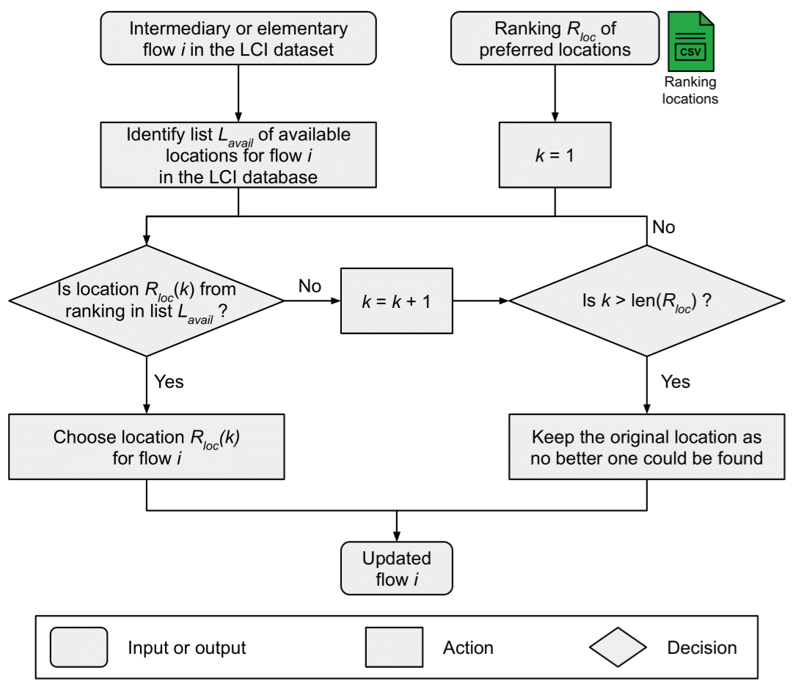

# Summary
`mescal` is a Python package that integrates Life-Cycle Assessment (LCA) indicators within any Energy System Model 
(ESM). `mescal` generates a set of LCA indicators for each technology and resource of the ESM. These indicators may be 
employed in an ex-post analysis, or be integrated as parameters in the ESM to add modelling constraints or define new 
objective functions.

# Statement of need

# Description
`mescal` is an extension of the work of @schnidrig2024. 

## Mapping between ESM processes and LCI datasets
Each technology or resource of the ESM is mapped with one or several LCI datasets. Technologies are typically mapped with two 
LCI datasets: 1) an operation LCI dataset, which encompasses the use phase of the technology's life cycle, and 2) an 
infrastructure LCI dataset, which encompasses the construction and dismantling phases of the technology's life cycle.
The ESM resources are typically mapped with one operation LCI dataset. `mescal` is suited for any version of the 
_ecoinvent_ database [@wernet2016].

## Regionalization of LCI datasets
To overcome a potential lack of location-specific LCI datasets in _ecoinvent_, the inventory can 
be regionalized. Inventory regionalization refers to the enhancement of the geographic representativeness of the 
inventory data, which includes the type and quantity of intermediary and elementary flows 
[@patouillard2018]. The foreground inventory is regionalized by modifying the geographical location of 
the flows of all infrastructure and operation LCI datasets according to a user-defined ranking of preferred locations 
(\autoref{fig:flowchart_regionalization}). The types and quantities of the flows remain unchanged. The background 
inventory can be regionalized too using the `regioinvent` tool [@maximeagez2025].

## Double-counting removal
Double-counting refers to the overestimation of impacts due to the multiple occurrence of the same flow, potentially 
represented through different energy vectors, within the energy system supply chain. Volkart et al. proposed a solution 
to the double-counting issue by setting to zero all flows in the foreground inventory that were also modelled in the ESM
[@volkart2018]. This approach is implemented in `mescal` by identifying the flows to be nullified using their Central 
Product Classification (CPC) categories defined by the @unitednations2015 (\autoref{fig:flowchart_double_counting}).

## ESM and LCA database harmonization
LCI datasets and LCIA scores are systematically adjusted to account for differences between the ESM and LCA databases:
- **Technologies lifetime**: LCA scores are adjusted to integrate the difference in lifetime between the ESM technologies and
their infrastructure LCI datasets. The specific LCIA impact is multiplied by the ratio between the ESM lifetime and the LCI 
dataset lifetime to ensure that the annual impact in the ESM is computed with the LCI dataset lifetime. 
This ensures that the coherence between the LCA score and the LCI dataset lifetime is maintained.

- **Technologies efficiency**: Even if fuel flows are set to zero in the operation LCI dataset to prevent 
double-counting, a difference in efficiency between an ESM technology and its corresponding operation LCI 
dataset would result in inconsistencies regarding the amount of direct emissions. This issue is resolved by adjusting 
the amount of direct emissions proportionally to the efficiency ratio. Except land occupation, land transformation and 
energy elementary flows, the amounts of all elementary flows in operation LCI datasets are adjusted using the efficiency
ratio. The efficiency of the operation LCI dataset is automatically computed using the quantity of fuel that was removed
to address the double-counting issue. This transformation is applied to a list of ESM technologies given by the user, 
typically technologies involving a combustion process. 

- **Physical units**: The energy and material output flows may be expressed in different units in the ESM and the LCI 
database. Specific LCA scores are multiplied by a conversion factor, which converts the specific LCA 
scores physical unit from [LCIA unit / LCI output unit] to [LCIA unit / ESM output unit]. Conversion factors 
encompass LCI datasets assumptions such as capacity factors or vehicle load factors.

- **Generation of new LCI datasets**: New LCI datasets can be generated by operating modifications on existing ones, 
to enhance their alignment with the ESM technology. For example, biodiesel-fuelled mobility 
LCI datasets are created by replacing direct fossil carbon emissions by biogenic carbon emissions, while the diesel input 
is set to zero to solve the double-counting issue. 

## Life-Cycle Impact Assessment
LCA indicators can be computed using any impact assessment method, e.g., IMPACT World+ [@bulle2019], ReCiPe 
[@huijbregts2017] or Environmental Footprint (EF) [@europeancommission.jointresearchcentre.2018]. 

## Normalization of LCA indicators 
Prior to integration into the ESM, LCA indicators are normalized. In the context of optimization, 
normalization is beneficial in facilitating the solver's convergence, given that LCA indicators may exhibit 
significant discrepancies in magnitude across impact categories. By aligning all metrics within a comparable order of 
magnitude, numerical stability is improved in the solving process. Furthermore, considerable discrepancies in magnitude 
may be observed between infrastructure and operation LCA indicators within the same impact category, given that 
these are not expressed with the same unit. Consequently, an adjustment factor was applied to infrastructure LCIA indicators, 
with the objective of ensuring that both the highest infrastructure and operation metric were normalized to 1. 
This adjustment factor is accounted when converting the normalized results into physical results.

## Integrating ESM results in the LCI database
Relevant LCI datasets, e.g., markets for electricity, heat or mobility for the location of interest, are overwritten
using the ESM results. This allows the accounting of past changes in the environmental profile within a myopic 
transition pathway model.

\autoref{fig:workflow} shows the `mescal` workflow.

An [example notebook](https://github.com/matthieu-str/mescal/blob/master/examples/tutorial.ipynb) is available to 
illustrate the use of `mescal`.

# Impact

# Conclusion

# Acknowledgements
The authors gratefully acknowledge the financial support of the _Fonds de recherche du Québec - Nature et 
Technologies_, the _Institut de l’énergie Trottier de Polytechnique Montréal_ and the _CREATE-SEED_ program.

# References